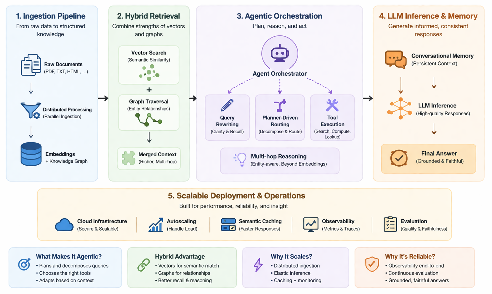

<div align="center">

# Scalable Agentic RAG Pipeline

**A cloud-native platform for large-scale retrieval, reasoning, and LLM-powered knowledge processing.**

Built to support production-grade agentic workflows through hybrid retrieval (vector + graph), distributed inference, scalable orchestration, and end-to-end observability. The platform combines LangGraph agents, Ray-based distributed execution, vLLM inference, knowledge graphs, and Kubernetes-native infrastructure to enable reliable and cost-efficient deployment of enterprise AI systems.

<br>

<p align="center">
  <!-- Core Platform -->
  
  
  

  <!-- AI & Orchestration -->
  
  

  <!-- Data Layer -->
  
  
  
  

  <!-- Distributed Systems -->
  
  

  <!-- Infrastructure -->
  
  
  
  
  

  <!-- Observability -->
  
  
  
</p>

<p align="center">
  
</p>

</div>

---

## 📂 Architecture Overview


```
scalable-agentic-rag-pipeline/
├── deploy/
│   ├── helm/
│   │   ├── api/     
│   │   │   ├── templates/    
│   │   │   │   ├── deployment.yaml       # fastapi app deployment with autoscaling, probes, and resource limits
│   │   │   │   └── service.yaml          # internal k8s service exposing the API deployment
│   │   │   │    
│   │   │   ├── charts.yaml               # helm chart metadata and dependency definitions
│   │   │   └── values.yaml               # graph DB with 8GB RAM and 100GB persistent volume
│   │   │
│   │   ├── neo4j/ 
│   │   │   └── values.yaml               # graph DB with 8GB RAM and 100GB persistent volume
│   │   │
│   │   └── qdrant/ 
│   │       └── values.yaml               # 3-replica vector DB with persistent SSD and on-disk payload
│   │
│   ├── ingress/
│   │   ├── nginx.yaml                    # single load balancer routing with 1-hour streaming timeouts
│   │
│   ├── ray/
│   │   ├── autoscaling.yaml              # cpu and gpu worker scaling rules with 5-minute idle timeout
│   │   ├── ray-cluster.yaml              # head node, CPU ingestion workers and GPU inference workers
│   │   ├── ray-serve-embed.yaml          # embedding model with fractional GPU sharing
│   │   └── ray-serve-llm.yaml            # llm model with AWQ quantization and zero-downtime updates
│   │
│   ├── sandbox/
│   │   └── deployment.yaml               # isolated code-execution sandbox deployment with strict security policies

│   │
│   └── secrets/
│       ├── cluster-secret-store.yaml     # external Secrets Operator backend config for AWS Secrets Manager
│       └── external-secrets.yaml         # fetch secrets from AWS Secrets Manager and inject into pods
│
├── eval/
│   ├── datasets/
│   │   └── golden.json                   # benchmark dataset of curated question-answer pairs
│   │
│   ├── judges/
│   │   └── llm_judge.py                  # automated system answer grading using llm-as-a-judge pattern
│   │
│   └── ragas/
│       └── run.py                        # ragas evaluation pipeline for retrieval and generation quality
│
├── infra/
│   ├── karpenter/
│   │   ├── provisioner-cpu.yaml          # spot instance provisioner with consolidation for stateless API pods
│   │   └── provisioner-gpu.yaml          # on-demand/spot GPU provisioner with 30s scale-to-zero for LLM inference
│   │
│   └── terraform/
│       ├── ecr.tf                        # ECR repositories for API, models, and container image lifecycle policies
│       ├── eks.tf                        # EKS cluster with OIDC enabled system node group
│       ├── iam.tf                        # least-privilege IRSA roles binding pods to scoped S3 policies
│       ├── main.tf                       # providers, remote state backend (S3 + DynamoDB locking)
│       ├── neo4j.tf                      # security groups restricting neo4j bolt port to VPC-only traffic
│       ├── outputs.tf                    # exports endpoints for kubernetes secret configuration
│       ├── rds.tf                        # aurora serverless v2 postgresql scaling
│       ├── redis.tf                      # elasticache redis with primary/replica HA and encryption
│       ├── s3.tf                         # versioned document bucket with transfer acceleration and lifecycle tiering
│       ├── variables.tf                  # parameterized inputs for multi-environment deployments
│       └── vpc.tf                        # 3-tier network (public, private, database subnets)
│
├── libs/
│   ├── observability/
│   │   ├── metrics.py                    # prometheus metrics for request throughput, latency and token usage
│   │   └── tracing.py                    # opentelemetry distributed tracing configuration and span utilities
│   │
│   ├── schemas/
│   │   ├── chat.py                       # pydantic data models (schemas) used across the RAG chat system
│   │
│   └── utils/
│       ├── backoff.py                    # retry mechanism using exponential backoff for transient failures
│       ├── document_parsing.py           # dynamic handler to parse different documents
│       ├── ids.py                        # generate unique IDs for chat sessions, files, and OpenTelemetry traces
│       └── timing.py                     # measure execution time of functions for performance monitoring
│
├── models/
│   ├── embeddings/
│   │   └── bge-m3.yaml                   # configuration for embedding model (bge-m3)
│   │
│   ├── llm/
│   │   ├── llama-7b.yaml                 # configuration for llama-3-7b-Instruct/TinyLlama (ligher tasks)
│   │   └── llama-70b.yaml                # configuration for llama-3-70b-Instruct (heavy tasks)
│   │
│   └── rerankers/
│       └── bge-reranker.yaml             # configuration for reranker (bge-m3)
│
├── pipelines/
│   ├── ingestion/
│   │   ├── chunking/     
│   │   │   ├── metadata.py               # enrich chunk metadata and create hashes for deduplication
│   │   │   └── splitter.py               # text splitting and chunking logic
│   │   │
│   │   ├── embedding/       
│   │   │   └── compute.py                # ray worker that batches text and generates embeddings
│   │   │
│   │   ├── graph/       
│   │   │   ├── schema.py                 # defines allowed node and relationship schema for the knowledge graph
│   │   │   └── extractor.py              # extracts entities and relationships from text using an LLM
│   │   │
│   │   ├── indexing/     
│   │   │   ├── qdrant.py                 # writes embedding vectors to the Qdrant vector database
│   │   │   └── neo4j.py                  # writes knowledge graph nodes and relationships to Neo4j
│   │   │
│   │   ├── loaders/
│   │   │   ├── docx.py                   # parses Word documents and extracts text
│   │   │   ├── html.py                   # parses HTML content and extracts clean text
│   │   │   └── pdf.py                    # parses PDF files using layout-aware extraction
│   │   │
│   │   ├── config.yaml                   # configuration for ingestion pipeline
│   │   └── main.py                       # orchestrates the distributed ingestion pipeline using Ray
│   │
│   └── jobs/
│       ├── ray_job.yaml                  # [Manual dev/testing] Ray job specification used by the Ray Job Submission API
│       └── s3_event_handler.py           # [Auto prod] Lambda handler, listens for S3 uploads and submits ingestion jobs to Ray
│
├── scripts/
│   ├── bootstap_cluster.sh               # pre-flight cluster setup and application deployment in dependency order
│   ├── bulk_upload_s3.py                 # high-performance parallel uploader to push datasets to S3
│   ├── cleanup.sh                        # safe teardown of all helm releases and terraform infrastructure
│   ├── load_test.py                      # locust-based load testing for api performance and autoscaling validation
│   ├── merge_data.py                     # organized merging of data from different sources
│   ├── migrate_db.sh                     # alembic database migration runner for zero-downtime schema updates
│   ├── scrape_k8s_docs.py                # k8s documentation scraping
│   ├── warmup_cache.py                   # semantic cache pre-warming script for post-deployment cold start prevention
│
├── services/
│   ├── api/
│   │   ├── app/
│   │   │   ├── agents/
│   │   │   │   ├── nodes/
│   │   │   │   │   ├── planner.py        # first node in the LangGraph that decides what action to take
│   │   │   │   │   ├── responder.py      # final node that synthesizes retrieved documents into a coherent answer
│   │   │   │   │   ├── retriever.py      # retriever node, that fetches context before the LLM generates an answer
│   │   │   │   │   └── tool.py           # tool node, handles the "tool_use" branch from the planner
│   │   │   │   │
│   │   │   │   ├── graph.py              # graph definition, that connects all nodes into a runnable agent
│   │   │   │   ├── state.py              # shared state object that flows between nodes in the LangGraph agent
│   │   │   │   └── tokenCount.py         # helper to count token used by agents
│   │   │   │
│   │   │   ├── auth/
│   │   │   │   └── jwt.py                # handle JWT authentication for authorized uses of GPU
│   │   │   │
│   │   │   ├── cache/
│   │   │   │   ├── redis.py              # singleton Redis client for cache and rate limiting
│   │   │   │   └── semantic.py           # semantic caching to avoid unnecessary llm calls 
│   │   │   │
│   │   │   ├── clients/
│   │   │   │   ├── neo4j.py              # async Neo4j graph database client for executing Cypher queries
│   │   │   │   ├── qdrant.py             # async Qdrant vector database client for semantic search
│   │   │   │   ├── ray_embed.py          # async client for Ray embedding service
│   │   │   │   └── ray_llm.py            # async HTTP client to call Ray LLM service
│   │   │   │
│   │   │   ├── enhancers/       
│   │   │   │   ├── hyde.py               # advanced rag technique (hyde) to improve accuracy
│   │   │   │   └── query_rewritter.py    # query enhancer to standardize the original query
│   │   │   │
│   │   │   ├── memory/       
│   │   │   │   ├── models.py             # sqlalchemy orm model for persisting chat history to rdbms
│   │   │   │   └── postgres.py           # async pgsql CRUD for conversation history
│   │   │   │
│   │   │   ├── models/ 
│   │   │   │   ├── Dockerfile            # multi-mode model serving image (CPU embedding and GPU vLLM inference)
│   │   │   │   ├── llm_engine.py         # deploys an LLM inference service using Ray Serve and vLLM
│   │   │   │   └── embedding_engine.py   # deploys embedding service using Ray Serve and sentence_transformers
│   │   │   │
│   │   │   ├── routes/  
│   │   │   │   ├── chat.py               # main chat entrypoint route
│   │   │   │   ├── feedback.py           # user feedback (RLHF) route to improve the system
│   │   │   │   ├── health.py             # k8s health checks routes
│   │   │   │   └── upload.py             # efficient user file upload route
│   │   │   │
│   │   │   ├── tools/  
│   │   │   │   ├── calculator.py         # safe math expression evaluator using AST parsing
│   │   │   │   ├── graph_search.py       # entity-aware Neo4j search with Cypher injection prevention
│   │   │   │   ├── sandbox.py            # api client for sandbox communication
│   │   │   │   ├── vector_search.py      # document retrieval tool exposing Qdrant semantic search
│   │   │   │   └── web_search.py         # real-time external knowledge retrieval via Tavily API
│   │   │   │
│   │   │   ├── config.py                 # validates that all our database URLs and API keys exist at startup
│   │   │   ├── logging.py                # custom structured JSON logging system
│   │   │   └── observability.py          # observability module that wires OpenTelemetry tracing into a FastAPI app
│   │   │  
│   │   ├── Dockerfile                    # fastapi application container image
│   │   ├── main.py                       # agentic application entry point 
│   │   └── requirements.txt
│   │
│   ├── gateway/
│   │   ├── Dockerfile                    # OpenResty API gateway with Redis-backed rate limiting
│   │   ├── nginx.conf                    # loads the Lua script
│   │   └── rate_limit.lua                # rate limiting using Redis (Token Bucket Algorithm)
│   │
│   └── sandbox/
│       ├── Dockerfile                    # minimal hardened container that runs the sandbox server as a non root user
│       ├── limits.yaml                   # resource limits configuration for the sandbox
│       ├── network-policy.yaml           # k8s firewall against data exfiltration
│       └── runner.py                     # flask server (core of the sandbox) that safely runs the untrusted code
│
├── .dockerignore
├── .env
├── .gitignore
├── .python-version
├── docker-compose.yaml
├── main.py
├── Makefile
├── pyproject.toml
├── README.md
└── uv.lock
```

---

## 📚 Getting Started Guide

**1. Configure AWS**

```bash
aws configure
```

**2. Provision Infrastructure**

Creates the AWS infrastructure required by the platform.

```bash
make infra
```

**3. Store Application Secrets**

Create the required secrets in AWS Secrets Manager.

```bash
prod/rag/db_creds
prod/rag/api_keys
```

**4. Build and Push Images**

Builds and publishes the API and model-serving images to Amazon ECR.

```bash
make docker
```

**5. Bootstrap the Cluster**

Deploys the platform components to Kubernetes.

```bash
make bootstrap
```

**6. Upload Documents**

```bash
python3 scripts/bulk_upload_s3.py <local_directory> <bucket_name>
```

**7. Access the Platform**

After deployment, the API becomes available through the configured ingress endpoint.

```bash
POST /api/v1/chat/stream
POST /api/v1/upload/generate-presigned-url
```

**8. Cleanup**

Remove all deployed resources.

```bash
make infra-destroy
```

👉 For a detailed deployment, and request lifecycle walkthrough, see [DEPLOYMENT_GUIDE.md](/assets/docs/DEPLOYMENT_GUIDE.md). To recreate this project from scratch, see [IMPLEMENTATION_GUIDE.md](/assets/docs/IMPLEMENTATION_GUIDE.md)


## License

This project is licensed under the [MIT License](https://opensource.org/licenses/MIT).